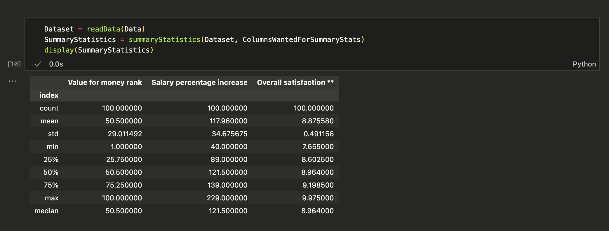
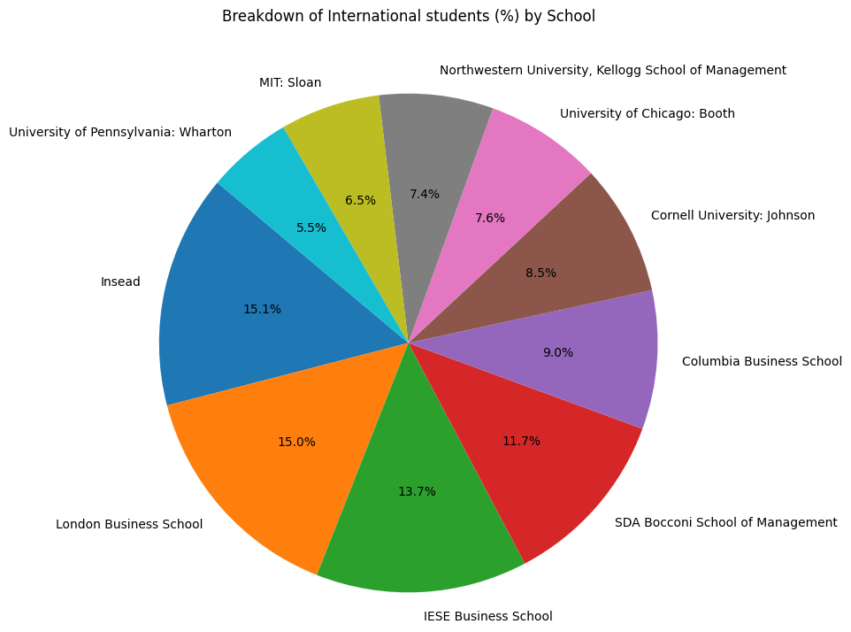
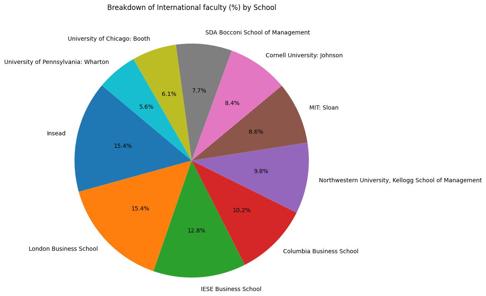
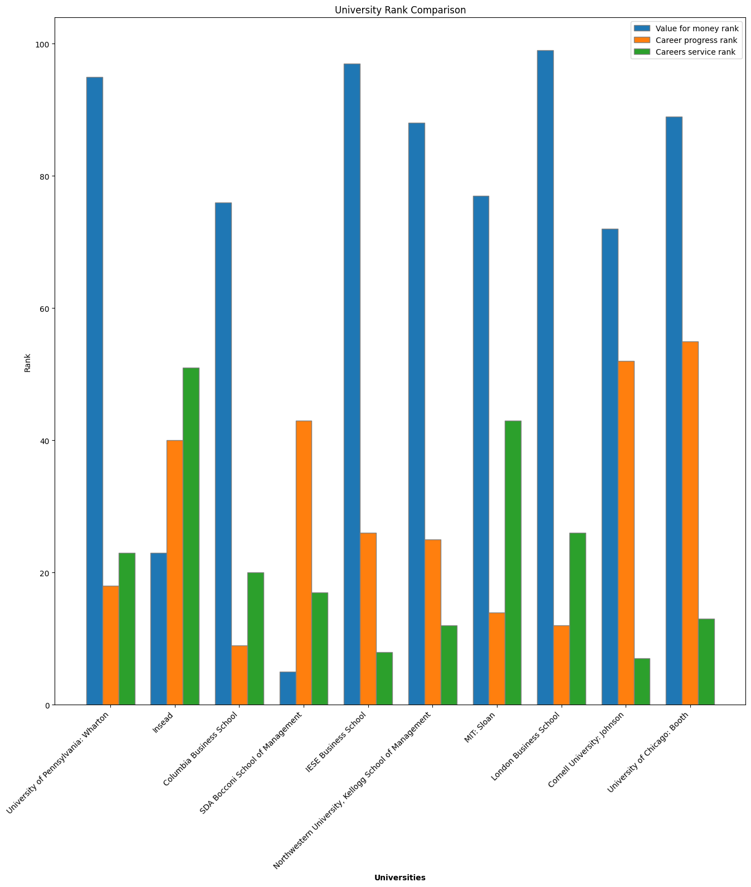

# Week 3
# Nakiyah_IndividualProject1

[](https://github.com/nogibjj/Nakiyah_MiniProject1/actions/workflows/install.yml)  [](https://github.com/nogibjj/Nakiyah_MiniProject1/actions/workflows/format.yml)  [](https://github.com/nogibjj/Nakiyah_MiniProject1/actions/workflows/lint.yml)  [](https://github.com/nogibjj/Nakiyah_MiniProject1/actions/workflows/test.yml)


## File Structure 
```
Nakiyah_IndividualProject1/
├── .devcontainer/
│   ├── devcontainer.json
│   └── Dockerfile
├── .github/
│   ├── workflows/format.yml
│   ├── workflows/install.yml
│   ├── workflows/lint.yml
│   ├── workflows/test.yml
├── mylib/
│   ├── lib.py
├── .gitignore
├── Makefile
├── main_file.py                                         
├── main_file.ipynb                                      
├── test_file.py                                    
├── test_lib.py                                     
├── requirements.txt                                
├── FT Global Business School MBA Ranking 2024.csv                  
├── piePlotStudents.png                              
├── piePlotFaculty.png
├── barPlotUniversityRank.png
├── SummaryStats.png                             
```


## Overview
This repository analyzes the FT Global Business School MBA Ranking 2024 dataset. The project uses Python and jupyter notebook for data processing, visualization, and automated testing, with additional support for containerized development and a CI/CD pipeline.


## Functions Overview
- **`readData(df)`**: Reads a CSV file into a Polars DataFrame with specified encoding.

- **`summaryStatistics(df, Col)`**: Generates summary statistics, median, and mean for a specified column.

- **`cleanData(df, ColToSort, Columns, RanksRequired)`**: Sorts a DataFrame by a column and selects the top N rows for specified columns.

- **`PiePlot(df, col, labels_col)`**: Creates a pie chart showing the breakdown of a specified column by labels.

- **`tripleBarPlot(df, Col, RankCols)`** The tripleBarPlot function creates a grouped bar chart comparing the ranks of universities across multiple ranking columns


## Summary stats showing the results for inputed dataset:




## Data Visualisation 

### Breakdown of International Students


### Breakdown of International Faculty




The code and notebooks can be run locally for analysis.


